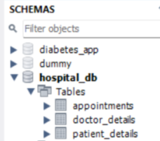

# 🏥 Hospital Management System – SQL Project

##  Project Description
This project is a MySQL-based Hospital Management System designed to manage doctors, patients, and appointments efficiently.  
It demonstrates core and advanced SQL concepts used in real-world database systems.

---

##  Technologies Used
- MySQL 8.0
- MySQL Workbench
- SQL

---

##  Database Structure

### Tables
- **doctor_details**
- **patient_details**
- **appointments**

##  Database Schema

---

##  Key Features
- Relational database design with Primary & Foreign Keys
- Constraints: NOT NULL, UNIQUE, CHECK, DEFAULT
- CRUD operations
- Filtering and sorting
- Aggregate functions
- Joins (INNER, LEFT, RIGHT)
- Subqueries & EXISTS
- Views
- Indexing
- Stored Procedure

---

##  SQL Concepts Covered
- SELECT, INSERT, UPDATE, DELETE
- WHERE, LIKE, BETWEEN, IN
- GROUP BY, HAVING
- JOINS & UNION
- Subqueries
- Views
- Indexes
- Stored Procedures

---

##  How to Run the Project
1. Open MySQL Workbench
2. Create a new SQL tab
3. Copy and paste `Hospital_project.sql`
4. Execute the script
5. Start running queries

---

## 👤 Author
**Sakthi Kumar B**  
SQL & Data Analytics Learner
